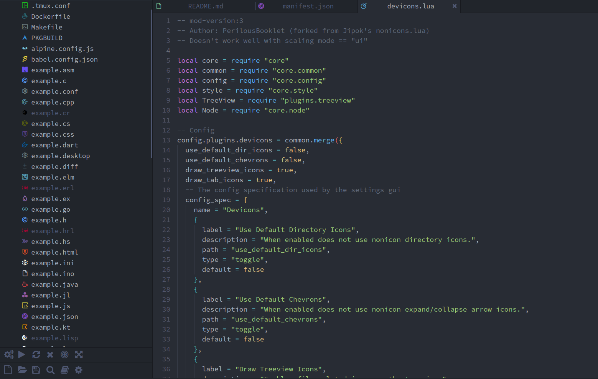
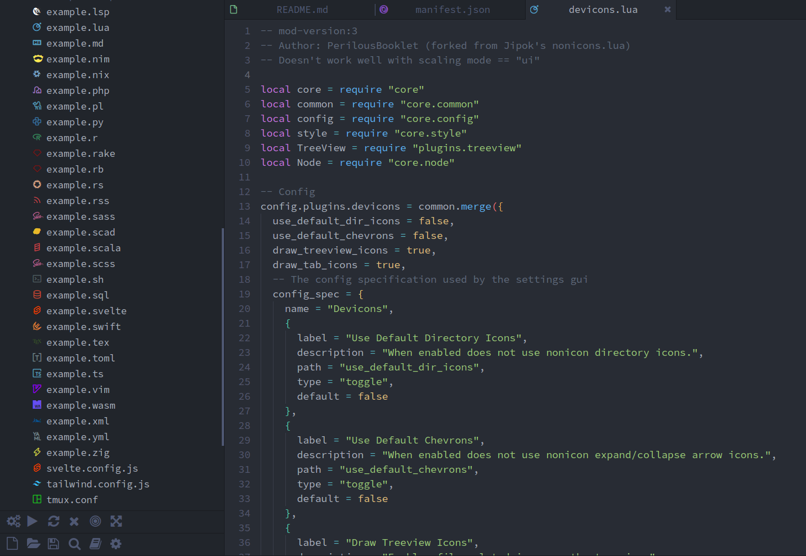
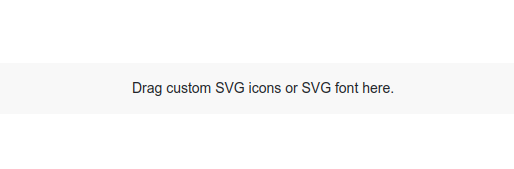

# Devicons for Lite XL's project tree view





## How to install
Open a terminal window and run the following commands:
```sh
lpm repo add "https://github.com/PerilousBooklet/lite-xl-devicons"
lpm install devicons
```

## How to prepare svg icons to be added to the font
WIP

## How to add a new entry to devicons.lua
WIP

## How to add svg icons to the font
Clone the repo somewhere on your system.

Go to https://fontello.com/

Drag and drop the .zip archive into the editor

Drag and drop the desired svg icons into the editor:



Select the desired icons with the cursor.

Go to the "Customize codes" menu, copy the glyph and paste it into a new entry inside `./plugins/devicons.lua`.

## Credits
- https://github.com/yamatsum/nonicons
- https://github.com/lite-xl/lite-xl-plugins/blob/master/plugins/nonicons.lua
